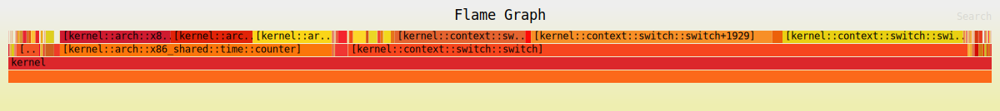

# Performance

## Kernel Profiling

You can create a flamegraph showing the kernel's most frequent operations, using time-based sampling.

One CPU core is allocated for capturing the profiling data. The instruction pointers of the other cores are copied at regular intervals. If the sampled core is in supervisor mode, the instruction address is added to the profile data. If it is in user mode, it is ignored. The `profiled` daemon copies the captured profile data to a file.

This is an example flamegraph. If you open the image in a new tab, there is useful mouse-over behavior.



The steps below are for profiling on `x86_64`, running in `QEMU`. It is possible to run the tests on real hardware, although retrieving the data may be challenging.

### Setup

1. Open a terminal window in the `redox` directory.

2. Install tools: 

```sh
cargo install redox-kprofiling
cargo install inferno
```

3. Make sure you have the kernel source by running `make f.kernel`.

4. Open a second terminal window in the directory `cookbook/recipes/core/kernel`.

5. Edit `recipe.toml` in the `kernel` directory. First, comment out the `[source]` section so the build process does not try to fetch the source again.

```toml
# [source]
# git = "https://gitlab.redox-os.org/redox-os/kernel.git"
```

6. You need to enable the `profiling` feature for the kernel. This can be done two ways, either in `recipe.toml` or in `source/Cargo.toml`. For `recipe.toml`, add the line `--features profiling \` to the `cargo` command. (The backslash is needed to continue the command.)
```sh
cargo rustc \
	--bin kernel \
    --features profiling \ <- Add this line
    ...
```

If you prefer to modify `source/Cargo.toml`, then you can add `profiling` to the default features. (This also helps if you are using an IDE.)

```toml
[features]
default = ["profiling", ...]
```

7. (Optional) In the `kernel` directory, edit `source/src/profiling.rs`: set `HARDCODED_CPU_COUNT` to the number of CPU cores on the machine that will be profiled, minus one (one core is dedicated to profiling). Also consider changing the size of the buffers used for recording profile data, `const N: usize`, depending on how much RAM is available. 64MiB is a reasonable minimum, but if you have the memory available, you can increase it to 256MiB.

8. The profiling code is written primarily for QEMU, but for real hardware, consider commenting out the `serio_command` code in `profiling.rs`, which is to enable or disable profiling.

9. In your first terminal window, from the `redox` directory, create the filesystem config `config/x86_64/my_profiler.toml` with the following content.
```toml
# General settings
[general]
# Filesystem size in MiB
filesystem_size = 1024

# Package settings
[packages]
# This is the profiling daemon
profiled = {}
# Add any other packages you need for testing here

# Init script to start the profile daemon
# The sequence number "01" ensures it will be started right after the drivers
[[files]]
path = "/usr/lib/init.d/01_profile"
data = """
profiled
"""

# Script to perform performance tests - add your tests here
# If you will be testing manually, you don't need this section
[[files]]
path = "/usr/lib/init.d/99_tests"
data = """
echo Waiting for startup to complete...
sleep 5
echo
echo Running tests...
dd bs=4k count=100000 < /scheme/zero > /scheme/null
echo Shutting down...
shutdown
"""
```

10. In the `redox` directory, create the file `.config` with the following content.

```make
# This needs to match the name of the config file
CONFIG_NAME=my_profiler
# Core count; this needs to be HARDCODED_CPU_COUNT+1
QEMU_SMP=5
# Memory size in MiB; 8GiB is the minimum, larger is better
QEMU_MEM=8192
```

11. In the `redox` terminal window, `make r.kernel image` (or `make rebuild` if needed).

### Profiling

12. In your `redox` terminal window, run `make qemu_nvme` or your preferred QEMU command, and perform your testing. You will see console messages indicating that profile data is being logged. **Exit QEMU** before proceeding.

14. In the `redox` directory, run the following commands.

```sh
# Create a directory for your data
mkdir my_profile_data
# Make the Redox filesystem accessible at the path based on CONFIG_NAME
make mount
# Copy the profiling data from the Redox image to your directory
cp build/x86_64/my_profiler/filesystem/root/profiling.txt my_profiler_data
# Important - unmount the Redox filesystem
make unmount
```

15. `cd` into the new directory and generate a symbol table for the kernel.

```sh
cd my_profiler_data
nm -CS ../cookbook/recipes/core/kernel/target/x86_64-unknown-redox/build/kernel > kernel_syms.txt
```

16. The next step is to determine the TSC frequency. tl;dr - just use your CPU clock rate in GHz. The TSC is a counter that tracks the clock cycles since the system was powered on. The TSC frequency can vary based when power saving is enabled, but Redox does not implement this yet, so CPU GHz should work fine.

17. Determine what formatting options you want for your flamegraph - 'i' for relaxed checking of function length, 'o' for reporting function plus offset rather than just function, 'x' for both grouping by function and with offset.

18. In the directory `my_profiler_data`, generate the flamegraph.

```sh
redox-kprofiling profiling.txt kernel_syms.txt x 2.2 | inferno-collapse-perf | inferno-flamegraph > kernel_flamegraph.svg
```

Replace the `x` with your preferred formatting options. Replace the `2.2` with your TSC/CPU Clock frequency in GHz.

Then view your flamegraph in a browser.

```sh
firefox flamegraph.svg
```

### Real hardware (untested)

- You need to set `HARDCODED_CPU_COUNT` to the number of actual CPU cores - 1, and there must be at least 512 MiB reserved per core.

- Boot the system, and when you're done profiling, kill `profiled` and extract `/root/profiling.txt` (Details TBD)
