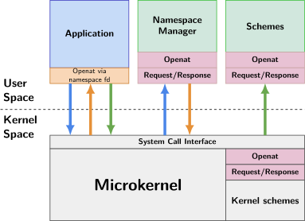

# Communication

This page explains how a program communicates with the system components.

TODO: verify if outdated information is present

## Context

- A scheme is a system service
- SQE means "Submission Queue Entry"
- CQE means "Completion Queue Entry"
- POSIX and Linux functions are implemented by relibc using Redox services provided by schemes, they work with the Applicationropriate schemes to implement the function. It might involve opening a scheme, maybe writing to a scheme, or maybe calling `mmap` on the scheme after opening (this is pretty common).
- relibc and redox-rt talk to the scheme via a system call - open, read, write, mmap, etc.
- A system component (userspace daemon) uses the Scheme API (from the `redox-scheme` library) to implement the system service. The Scheme API also is doing system calls like `open`, `read` and `write`, but the message format for reading and writing is a special format. The latest version of the Scheme API reads SQE messages and writes CQE messages. SQE is basically the parameters to the system call that the caller originally did, packaged into a message. CQE is the response that the daemon sends back.
- The kernel is responsible for creating the SQE messages, and for unpacking the CQE messages.

## System Function Usage Example

The following sequence explain how a application using a system function happens in Redox communication design.

1. The program calls some POSIX or Linux function from relibc
2. relibc/redox-rt convert it to system calls
3. The kernel converts the system calls to SQE
4. The userspace daemon calls read on a "scheme socket" and gets an SQE message
5. The userspace daemon calls write on the scheme socket and sends a CQE message
6. The kernel converts the CQE message to the result of the system call
7. relibc/redox-rt gets the result from the system call and uses that to calculate the result of the POSIX or Linux function call

## File Access Design Example

The following event sequence explain how a file access using namespaces and capabilities happens in Redox communication design.

1. Application -> Kernel: The application calls the `openat` function with the scheme-rooted path (`/scheme/{scheme-name}`) on the namespace file descriptor to obtain the scheme's root file descriptor.
2. Kernel -> Namespace Manager: The Kernel forwards the request to the Namespace Manager.
3. Namespace Manager -> Kernel: The Namespace Manager returns the scheme's root file descriptor.
4. Kernel -> Application: The Kernel adds the scheme's root file descriptor into the Application's file descriptor table.
5. Application -> Kernel: The application calls `openat` with `/path/to/file` on the scheme's root file descriptor.
6. Kernel -> Scheme: The Kernel forwards the request to the target scheme.

The following diagram visually explain the sequence above:

