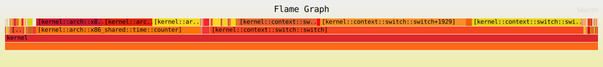

# Performance

- [Benchmarks](#benchmarks)
- [Profiling](#profiling)
  - [Kernel](#kernel)

## Benchmarks

This section contain commands for system benchmark.

- CPU performance

```sh
dd bs=1M count=1024 if=/scheme/zero | sha256sum
```

- RAM performance

```sh
dd bs=1M count=1024 if=/scheme/zero of=/scheme/null
```

- Filesystem read performance

(Add the `neverball` recipe on your filesystem image, by using the `make rp.neverball` or `sudo pkg install neverball` commands, or permanently adding using `neverball = {}` on your filesystem configuration)

```sh
dd bs=1M count=256 if=/usr/games/neverball/neverball of=/scheme/null conv=fdatasync
```

- Filesystem write performance

(Add the `neverball` recipe on your filesystem image, you can also install it with the `sudo pkg install neverball` command)

```sh
dd bs=1M count=256 if=/usr/games/neverball/neverball of=fs_write_speed_bench conv=fdatasync
```

- Userspace IPC performance

```sh
dd bs=4k count=100000 < /scheme/zero > /scheme/null
```

## Profiling

This section explain how to configure and do system performance profiling.

### Kernel

You can create a flamegraph showing the kernel's most frequent operations, using time-based sampling.

This is an example flamegraph. If you open the image in a new tab, there is useful mouse hover behavior.



The steps below are for profiling on `x86_64`, running in `QEMU`. It is possible to run the tests on real hardware, although retrieving the data require additional effort.

The profiling code is written primarily for QEMU, but for real hardware, consider commenting out the `serio_command` code in the `src/profiling.rs` file.

#### Setup

1. Open a terminal window in the `redox` directory.

2. Install the tools: 

```sh
cargo install redox-kprofiling
```

```sh
cargo install inferno
```

3. Rename the `kernel = {}` item at `config/base.toml` to `profiling-kernel = {}`

4. In your first terminal window, from the `redox` directory, create the filesystem configuration (`config/my_profiler.toml`, for example) or adapt your existing configuration with the following content:

```toml
include = [ "minimal.toml" ]

# General settings
[general]
# Filesystem size in MiB
filesystem_size = 256

# Package settings
[packages]
# The kernel recipe with profiling code enabled
profiling-kernel = {}
# This is the profiling daemon
profiled = {}
# Add any other recipes you need for testing here

# Init script to start the profile daemon
# The sequence number "01" ensures it will be started right after the drivers
[[files]]
path = "/usr/lib/init.d/01_profile"
data = """
profiled
"""

[[files]]
path = "/usr/bin/perf_tests.sh"
data = """
dd bs=4k count=100000 < /scheme/zero > /scheme/null
"""

# Script to perform performance tests - add your tests here
# If you will be testing manually, you don't need this section
[[files]]
path = "/usr/lib/init.d/99_tests"
data = """
echo Waiting for startup to complete...
sleep 5
echo
echo Running tests...
ion -x /usr/bin/perf_tests.sh
echo Shutting down...
shutdown
"""
```

If you don't want to use the `99_tests` file configuration, you can use the `kprof_record` command (can't be used in multiple commands) from `profiled` recipe.

5. In the `redox` directory, create the file `.config` with the following content:

```make
# This needs to match the name of your filesystem configuration file
CONFIG_NAME=my_profiler
# QEMU core count, add if you want to increase the default core count (4)
QEMU_SMP=5
# Don't use the QEMU GUI
gpu=no
```

6. In the `redox` terminal window, run the `make r.profiling-kernel image` command.

#### Profiling

7. In your `redox` terminal window, run `make qemu` or your preferred QEMU command, and perform your testing. You will see console messages indicating that profile data is being logged. **Exit QEMU** before proceeding, if it did not exit automatically.

8. In the `redox` directory, run the following commands.

```sh
# Create a directory for your data
mkdir my_profiler_data
```

```sh
# Make the Redox filesystem accessible at the path based on CONFIG_NAME
make mount
```

```sh
# Copy the profiling data from the Redox image to your directory
cp build/x86_64/my_profiler/filesystem/root/profiling.txt my_profiler_data
```

```sh
# Important - unmount the Redox filesystem
make unmount
```

9. `cd` into the new directory and generate a symbol table for the kernel.

```sh
cd my_profiler_data
```

```sh
nm -CS recipes/core/profiling-kernel/target/x86_64-unknown-redox/build/profiling-kernel > kernel_syms.txt
```

10. The next step is to determine the TSC frequency. TL;DR - just use your CPU clock rate in GHz. The TSC is a counter that tracks the clock cycles since the system was powered on. The TSC frequency can vary based when power saving is enabled, but Redox does not implement this yet, so CPU GHz should work fine.

11. Determine what formatting options you want for your flamegraph - 'i' for relaxed checking of function length, 'o' for reporting function plus offset rather than just function, 'x' for both grouping by function and with offset.

12. In the directory `my_profiler_data`, generate the flamegraph.

```sh
redox-kprofiling profiling.txt kernel_syms.txt x y.z | inferno-collapse-perf | inferno-flamegraph > kernel_flamegraph.svg
```

Replace the `x` with your preferred formatting options. Replace the `y.z` with your TSC/CPU clock frequency in GHz (`2.2`, for example).

Then view your flamegraph in a web browser.

```sh
firefox kernel_flamegraph.svg
```

#### Real Hardware

TODO: test

Boot the system, and when you're done profiling, kill `profiled` and extract `/root/profiling.txt` (Details TBD)
