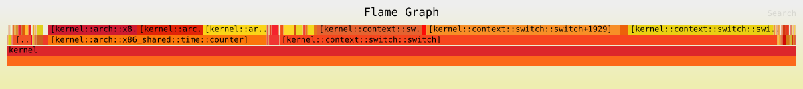

# Performance

- [Benchmarks](#benchmarks)
- [Profiling](#profiling)
  - [Kernel](#kernel)
- [Compare Performance Difference Between Commits](#compare-performance-difference-between-commits)

## Benchmarks

This section contain commands for system benchmark.

- CPU performance

```sh
dd bs=1M count=1024 if=/scheme/zero | sha256sum
```

- RAM performance

```sh
dd bs=1M count=1024 if=/scheme/zero of=/scheme/null
```

- Filesystem read performance

(Add the `neverball` recipe on your filesystem image, by using the `make rp.neverball` or `sudo pkg install neverball` commands, or permanently adding using `neverball = {}` on your filesystem configuration)

```sh
dd bs=1M count=256 if=/usr/games/neverball/neverball of=/scheme/null conv=fdatasync
```

- Filesystem write performance

(Add the `neverball` recipe on your filesystem image, you can also install it with the `sudo pkg install neverball` command)

```sh
dd bs=1M count=256 if=/usr/games/neverball/neverball of=fs_write_speed_bench conv=fdatasync
```

- Userspace IPC performance

```sh
dd bs=4k count=100000 < /scheme/zero > /scheme/null
```

## Targets

- `make flamegraph` : TODO
- `make rotate-flamegraph` : TODO
- `make differential-flamegraph` : TODO
- `make acid-output` : TODO
- `make rotate-acid-output` : TODO
- `make compare-acid-output` : TODO

## Profiling

This section explain how to configure and do system performance profiling.

### Kernel

You can create a flamegraph showing the kernel's most frequent operations, using time-based sampling.

This is an example flamegraph. If you open the image in a new tab, there is useful mouse hover behavior.



The steps below are for profiling on `x86_64`, running in `QEMU`. It is possible to run the tests on real hardware, although retrieving the data require additional effort.

If you use PS/2 input devices in real hardware you need to disable the `serio_command` code in the `src/profiling.rs` file.

#### Setup

1. Open a terminal window in the `redox` directory.

2. Install the tools: 

```sh
cargo install redox-kprofiling inferno
```

3. Rename the `kernel = {}` item at `config/base.toml` to `profiling-kernel = {}`

4. Temporarily install the `profiled` recipe with the `make rp.profiled` command or permanently install by adding it in the `[packages]` section of your filesystem configuration and run `make rp.profiled` :

```toml
[packages]
profiled = {}
```

5. Boot QEMU and use the `sudo kprof_record <app-command> [APP-ARGS...]` command to profile the kernel when running the specified application (can't be used with multiple applications in the same command).

6. (Optional) The following filesystem configuration is used for automated profiling: create the filesystem configuration (`config/my_profiler.toml`, for example) or adapt your existing configuration with the following content:

```toml
include = [ "minimal.toml" ]

# General settings
[general]
# Filesystem size in MiB
filesystem_size = 256

# Package settings
[packages]
bash = {}
profiled = {} # Profiling daemon
# Add any other recipes you need for testing here

[[files]]
path = "/usr/bin/perf_tests.sh"
data = """
#!/usr/bin/env bash
dd bs=4k count=100000 < /scheme/zero > /scheme/null
"""

# Script to perform performance tests - add your tests here
# If you will be testing manually, you don't need this section
[[files]]
path = "/usr/lib/init.d/99_tests"
data = """
echo Waiting for startup to complete...
sleep 5
echo
echo Running tests...
kprof_record /usr/bin/perf_tests.sh
echo Shutting down...
shutdown
"""
```

7. (Optional) In the `redox` directory, create the file `.config` with the following content:

```make
# This needs to match the name of your filesystem configuration file
CONFIG_NAME=my_profiler
# QEMU core count, add if you want to increase the default core count (4)
QEMU_SMP=5
# Don't use the QEMU GUI
gpu=no
```

8. In the `redox` terminal window, run the `make r.profiling-kernel,profiled image` command.

#### Profiling

**QEMU can't be running during this step, verify if it's closed beforehand to prevent data corruption**

9. The `make flamegraph` command will create a SVG of profiling data collected inside of Redox, the SVG location is: `build/flamegraph/$(TARGET)-$(CONFIG_NAME)-kflamegraph.svg`

Use the `KPROF_OPTIONS=option-value` environment variable to determine what formatting options you want for your flamegraph:

- 'i' for relaxed checking of function length
- 'o' for reporting function plus offset rather than just function
- 'x' for both grouping by function and with offset

Replace the "option-value" with your preferred formatting options.

Example:

```sh
make flamegraph KPROF_OPTIONS=xo
```

10. View your flamegraph SVG in a web browser.

```sh
firefox build/flamegraph/$(TARGET)-$(CONFIG_NAME)-kflamegraph.svg
```

#### Real Hardware

TODO: test

Boot the system, and when you're done profiling, kill `profiled` and extract the `/root/profiling.txt` file (Details TBD)

## Compare Performance Difference Between Commits

To measure improvements or detect regressions.

### Kernel

This section explain how to measure performance difference between kernel commit A and B.

1. Checkout commit A, rebuild recipe (`make cr.kernel`), and login as `root` user

2. Run one of the following commands and shutdown once finished:

```sh
kprof_record ACID_BENCH_OUTPUT=acid.txt
```

```sh
acid ACID_BENCH_OUTPUT=acid.txt
```

3. Run `make acid-output` and `make rotate-acid-output`

4. Checkout commit B, rebuild recipe (`make cr.kernel`), login as `root` user, and repeat step 2

5. Run `make acid-output` and `make compare-acid-output`

The comparison data is stored at: `build/$ARCH/$CONFIG_NAME/acid-output` (newer) and `build/$ARCH/$CONFIG_NAME/acid-output.old` (older)