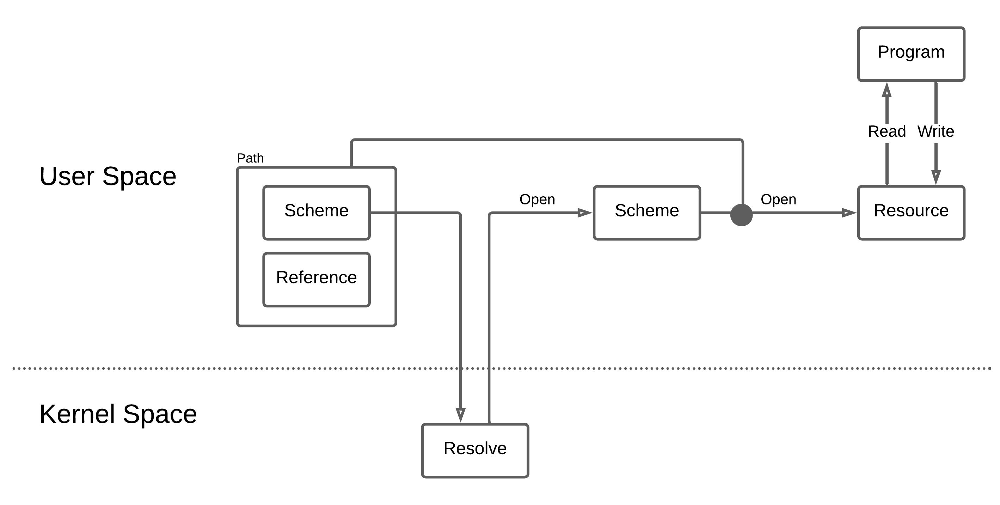

# Stiching It All Together

The "path, scheme, resource" model is simply a unified interface for efficient inter-process communication.
Paths are simply resource descriptors. Schemes are simply resource types, provided by scheme managers.

A diagram would look like this:

